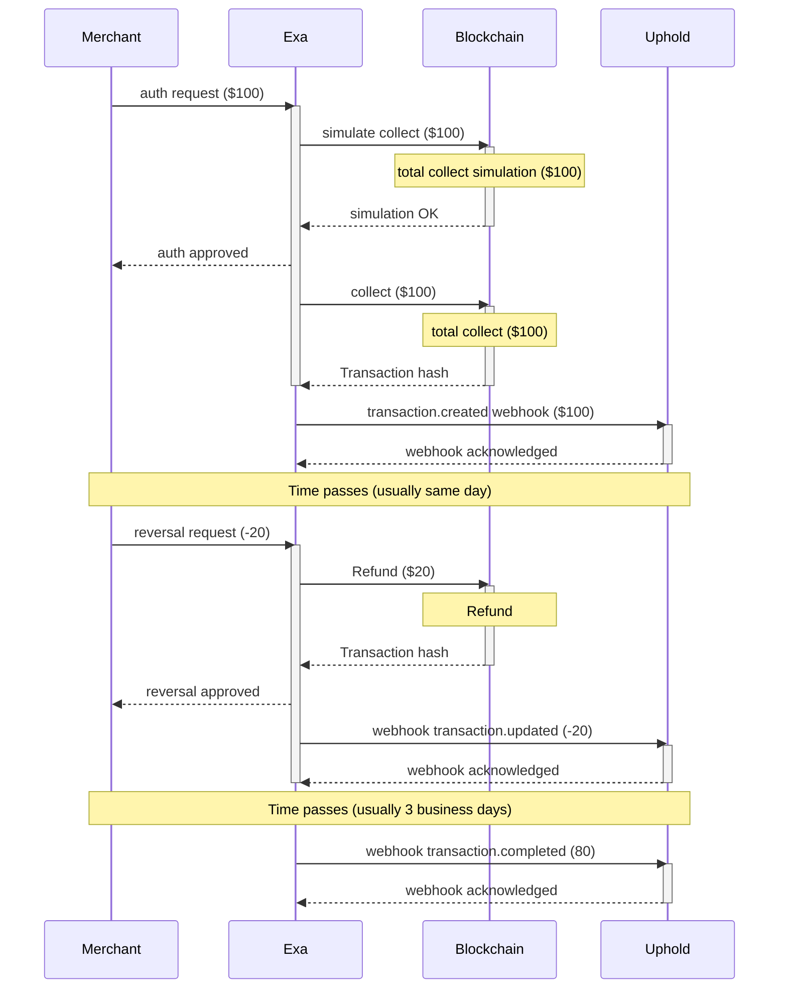

Webhooks enable real-time event notifications, allowing you to integrate external systems with Exa.

## Setting up webhooks

A default endpoint can be configured and optionally an endpoint for each of the 5 event types:

- Transaction created
- Transaction updated
- Transaction completed
- User updated
- Card updated

## Webhook security and signing

Each webhook request is signed using an HMAC SHA256 signature, based on the exact JSON payload sent in the body. This signature is included in the Signature HTTP header of the request.

You can verify webhook authenticity by computing the HMAC signature and comparing it to the `Signature` header included in the webhook request.

Example: Verifying a webhook signature (Node.js)

```typescript
import { createHmac } from "crypto";

const signature = createHmac("sha256", <YOUR_API_KEY>)
  .update(<REQUEST_BODY_AS_JSON_STRING>) // JSON.stringify(payload)
  .digest("hex");
```

Ensure that the computed signature matches the Signature header received in the webhook request before processing the payload.

## Retry policy and timeout

An exponential backoff with 20 retries and 60 second timeout is used. Retries occur if the request returns an http status code other than 2xx or times out.

| Retry Count | Delay (ms) | Delay (seconds) | Delay (minutes) |
|-------------|------------|-----------------|-----------------|
| 0 | 500 | 0.5s | - |
| 1 | 1,000 | 1s | - |
| 2 | 2,000 | 2s | - |
| 3 | 4,000 | 4s | - |
| 4 | 8,000 | 8s | - |
| 5 | 16,000 | 16s | - |
| ..... |  |  |  |
| 16 | 32,768,000 | 32768s | ~546.1min |
| 17 | 65,536,000 | 65536s | ~1092.3min |
| 18 | 131,072,000 | 131072s | ~2184.5min |
| 19 | 262,144,000 | 262144s | ~4369.1min |

## Webhook flows

There are 5 different types of flow that uses different events which details are in the `Event reference` section:

- Purchase lifecycle with settlement
- Partial capture
- Over capture
- Force capture
- Refund

### Purchase lifecycle with settlement

This example demonstrates a complete transaction lifecycle through webhook notifications, showing how a transaction progresses from initial transaction created to final settlement with an amount adjustment.



#### Transaction Created

Transaction authorized and created with timestamp, for $100.00 amount.

```json
{
  "id": "99493687-78c1-4018-8831-d8b1f66f58e2",
  "timestamp": "2025-08-13T14:36:04.586Z",
  "resource": "transaction",
  "action": "created",
  "receipt": {
    "blockNumber": 97,
    "transactionHash": "0xb0af3b716fc47e18519a74858690a8b428d9a5ac9c5537d08314443a5b1501db",
  },
  "body": {
    "id": "bdc87700-bf6d-4d7d-ac29-3effb06e3000",
    "type": "spend",
    "spend": {
      "amount": 10000,
      "currency": "usd",
      "cardId": "e874583f-47d9-4211-8ea6-3b92e450821b",
      "localAmount": 10000,
      "localCurrency": "usd",
      "merchantCity": "",
      "merchantCountry": "",
      "merchantCategory": "-",
      "merchantName": "Test",
      "authorizedAt": "2025-06-25T15:24:11.337Z",
      "authorizedAmount": 10000,
      "status": "pending"
    }
  }
}
```

#### Transaction Updated

Amount adjusted from $100.00 to $80.00 with status "reversed" and authorizationUpdateAmount of -$20.00
Note that this is a reversal, 1 of the 3 types of refunds.

```json
{
  "id": "e7b2853e-4bb7-4428-8dc2-27e604766dfa",
  "timestamp": "2025-08-12T20:08:37.707Z",
  "resource": "transaction",
  "action": "updated",
  "receipt": {
    "blockNumber": 98,
    "transactionHash": "0x8c6ef90db7901c43018b3b079ac5ccf84e9c1eb2aaf0fd5f1f8b3e2b97d25fa3",
  },
  "body": {
    "id": "bdc87700-bf6d-4d7d-ac29-3effb06e3000",
    "type": "spend",
    "spend": {
      "amount": 8000,
      "currency": "usd",
      "cardId": "e874583f-47d9-4211-8ea6-3b92e450821b",
      "localAmount": 8000,
      "localCurrency": "usd",
      "merchantCity": "",
      "merchantCountry": "",
      "merchantCategory": "-",
      "merchantName": "Test",
      "authorizedAt": "2025-06-25T15:24:11.337Z",
      "authorizedAmount": 8000,
      "authorizationUpdateAmount": -2000,
      "status": "reversed",
      "enrichedMerchantName": "Test",
      "enrichedMerchantCategory": "Education"
    }
  }
}
```

#### Transaction Completed

Final settlement at $80.00 with status "completed".

```json
{
  "id": "662eb701-f9ac-4baa-9f86-b341a730c98a",
  "timestamp": "2025-08-12T20:23:20.662Z",
  "resource": "transaction",
  "action": "completed",
  "body": {
    "id": "bdc87700-bf6d-4d7d-ac29-3effb06e3000",
    "type": "spend",
    "spend": {
      "amount": 8000,
      "currency": "usd",
      "cardId": "e874583f-47d9-4211-8ea6-3b92e450821b",
      "localAmount": 8000,
      "localCurrency": "usd",
      "merchantCity": "",
      "merchantCountry": "",
      "merchantCategory": "",
      "merchantName": "Test",
      "authorizedAt": "2025-06-25T15:24:11.337Z",
      "authorizedAmount": 8000,
      "status": "completed",
      "enrichedMerchantName": "Test",
      "enrichedMerchantCategory": "Education"
    }
  }
}
```

### Partial capture flow

In a partial capture, the merchant settles for less than the authorized amount. After receiving the transaction completed webhook, the over authorized and captured funds are released to the user. This flow is common in restaurants, where the final charge may be lower than the original authorization after accounting for tips.

#### Transaction Created

Transaction authorized and created with timestamp for $100.00 amount.

```json
{
  "id": "99493687-78c1-4018-8831-d8b1f66f58e2",
  "timestamp": "2025-08-13T16:37:08.862Z",
  "resource": "transaction",
  "action": "created",
  "receipt": {
    "blockNumber": 108,
    "transactionHash": "0x59be2972d1094e6abc14f595b71ed4e9e6ec4e2cd8d61e292f6debcba37e19b4",
  },
  "body": {
    "id": "be67eeb7-294a-42d9-b337-77bfad198aad",
    "type": "spend",
    "spend": {
      "amount": 10000,
      "currency": "usd",
      "cardId": "827c3893-d7c8-46d4-a518-744b016555bc",
      "localAmount": 10000,
      "localCurrency": "usd",
      "merchantCity": "",
      "merchantCountry": "",
      "merchantCategory": "-",
      "merchantName": "Test",
      "authorizedAt": "2025-06-25T15:24:11.337Z",
      "authorizedAmount": 10000,
      "status": "pending"
    }
  }
}
```

#### Transaction Completed

Final settlement at $90.00 with status "completed" and timestamp. The final amount is $90 and previously $100 was authorized and captured to the user so $10 is refunded. This is one of the 3 types of refunds.

```json
{
  "id": "a79306b2-bbbc-4511-9e58-ca9fbc9a2d9a",
  "timestamp": "2025-08-13T16:42:28.955Z",
  "resource": "transaction",
  "action": "completed",
  "receipt": {
    "blockNumber": 109,
    "transactionHash": "0xd3b27341a97f4621865d896713a82be4099c5e0ad18782fb134fa33a77bba937",
  },
  "body": {
    "id": "be67eeb7-294a-42d9-b337-77bfad198aad",
    "type": "spend",
    "spend": {
      "amount": 9000, // notice the partial capture
      "currency": "usd",
      "cardId": "827c3893-d7c8-46d4-a518-744b016555bc",
      "localAmount": 9000,
      "localCurrency": "usd",
      "merchantCity": "New York",
      "merchantCountry": "US",
      "merchantCategory": "5511",
      "merchantName": "PartialCapture Example",
      "authorizedAt": "2025-07-03T18:40:28.024Z",
      "authorizedAmount": 10000,
      "status": "completed",
      "enrichedMerchantName": "Partial capture Example",
      "enrichedMerchantCategory": "Business - Software"
    }
  }
}
```

### Over Capture

In an over capture, the merchant settles for more than the originally authorized amount. This flow is typically used in scenarios that involve tips or additional surcharges, such as dining or hospitality.
Certain industries, like restaurants and bars, are allowed to settle for more than the authorized amount—typically up to 20%—to accommodate tips and similar charges.

#### Transaction Created

Transaction authorized and created with timestamp for $100.00 amount.

```json
{
  "id": "9d96c8c9-d10f-4d3a-90b9-978eca13ae2a",
  "timestamp": "2025-08-13T16:53:21.455Z",
  "resource": "transaction",
  "action": "created",
  "receipt": {
    "blockNumber": 300,
    "transactionHash": "0x7faf9d14fde333a946c27f9e173c2d640ef3b4fbafc7e75d2a8a4b8743efb001",
  },
  "body": {
    "id": "be67eeb7-294a-42d9-b337-77bfad198aad",
    "type": "spend",
    "spend": {
      "amount": 10000,
      "currency": "usd",
      "cardId": "827c3893-d7c8-46d4-a518-744b016555bc",
      "localAmount": 10000,
      "localCurrency": "usd",
      "merchantCity": "New York",
      "merchantCountry": "US",
      "merchantCategory": "5812 - Restaurant",
      "merchantName": "OverCapture Example",
      "authorizedAt": "2025-07-03T18:53:49.958Z",
      "authorizedAmount": 10000,
      "status": "pending"
    }
  }
}
```

#### Transaction Completed

Final settlement at $110.00 with status "completed" and timestamp. Note that the final amount is 110 but 100 was authorized and captured so capturing an extra $10 to the user is needed.

```json
{
  "id": "593b0673-82ba-457b-afce-1cbd725f9e3c",
  "timestamp": "2025-08-13T16:55:11.934Z",
  "resource": "transaction",
  "action": "completed",
  "receipt": {
    "blockNumber": 499,
    "transactionHash": "0x2d3a8b61a94f5f36b0d64f3e6a7c5e1bb7eeba6004cd3f1dc7c02b265aec7b02",
  },
  "body": {
    "id": "be67eeb7-294a-42d9-b337-77bfad198aad",
    "type": "spend",
    "spend": {
      "amount": 11000, // notice the increase in the amount of settlement
      "currency": "usd",
      "cardId": "827c3893-d7c8-46d4-a518-744b016555bc",
      "localAmount": 11000,
      "localCurrency": "usd",
      "merchantCity": "New York",
      "merchantCountry": "US",
      "merchantCategory": "Restaurant",
      "merchantName": "OverCapture Example",
      "authorizedAt": "2025-07-03T18:53:49.958Z",
      "authorizedAmount": 10000,
      "status": "completed",
      "enrichedMerchantName": "Over Capture Example",
      "enrichedMerchantCategory": "Restaurants"
    }
  }
}
```

### Force Capture

A force capture occurs when a merchant settles a transaction without prior authorization. These transactions bypass the authorization phase and proceed directly to settlement. This flow is typically used in offline scenarios, such as in-flight purchases where the merchant does not have internet access.

#### Transaction completed

```json
{
  "id": "593b0673-82ba-457b-afce-1cbd725f9e3c",
  "timestamp": "2025-08-13T17:00:08.061Z",
  "resource": "transaction",
  "action": "completed",
  "receipt": {
    "blockNumber": 97,
    "transactionHash": "0xb0af3b716fc47e18519a74858690a8b428d9a5ac9c5537d08314443a5b1501db",
  },
  "body": {
    "id": "0x8eFc15407B97a28a537d105AB28fB442324CC2ee-card",
    "type": "spend",
    "spend": {
      "amount": 11000,
      "currency": "usd",
      "cardId": "0x8eFc15407B97a28a537d105AB28fB442324CC2ee-card",
      "localAmount": 11000,
      "localCurrency": "usd",
      "merchantCity": "New York",
      "merchantCountry": "US",
      "merchantCategory": "Restaurant",
      "merchantName": "OverCapture Example",
      "authorizedAt": "2025-07-03T18:53:49.958Z",
      "authorizedAmount": 10000,
      "status": "completed",
      "enrichedMerchantName": "Over Capture Example",
      "enrichedMerchantCategory": "Restaurants"
    }
  }
}
```

### Refund

Refunds are treated as negative transactions and may or may not reference the original transaction completed. Unlike reversals, refunds can be initiated independently of the original transaction and may occur well after the initial settlement.

#### Transaction created

The webhook is only for informational purpose, Exa does not return funds to the user with this event, is just to notify that a proper refund is coming and
do sanity checks.

```json
{
  "id": "a2684ac7-13bc-4b0e-ab4d-5a2ac036218a",
  "timestamp": "2025-08-13T17:08:50.609Z",
  "resource": "transaction",
  "action": "created",
  "body": {
    "id": "be67eeb7-294a-42d9-b337-77bfad198aad",
    "type": "spend",
    "spend": {
      "amount": -10000,
      "currency": "usd",
      "cardId": "827c3893-d7c8-46d4-a518-744b016555bc",
      "localAmount": -10000,
      "localCurrency": "usd",
      "merchantCity": "New York",
      "merchantCountry": "US",
      "merchantCategory": "5641 - Children's and Infant's Wear Store",
      "merchantName": "Test Refund",
      "authorizedAt": "2025-07-03T19:52:59.806Z",
      "authorizedAmount": -10000,
      "status": "pending"
    }
  }
}
 ```

#### Transaction Completed

Final settlement of -$100.00 with status "completed" and timestamp. Refund $100 to the user.

```json
{
  "id": "77474a56-51eb-4918-b09e-73cf20077b1b",
  "timestamp": "2025-08-13T17:12:48.858Z",
  "resource": "transaction",
  "action": "completed",
  "receipt": {
    "blockNumber": 97,
    "transactionHash": "0xb0af3b716fc47e18519a74858690a8b428d9a5ac9c5537d08314443a5b1501db",
  },
  "body": {
    "id": "be67eeb7-294a-42d9-b337-77bfad198aad",
    "type": "spend",
    "spend": {
      "amount": -10000,
      "currency": "usd",
      "cardId": "827c3893-d7c8-46d4-a518-744b016555bc",
      "localAmount": -10000,
      "localCurrency": "usd",
      "merchantCity": "New York",
      "merchantCountry": "US",
      "merchantCategory": "Children's and Infant's Wear Store",
      "merchantName": "Test Refund",
      "authorizedAt": "2025-07-03T19:52:59.806Z",
      "authorizedAmount": -10000,
      "status": "completed",
      "enrichedMerchantName": "Test Refund",
      "enrichedMerchantCategory": "Refunds - Insufficient Funds"
    }
  }
}
```

## Refunds

There are 3 types of operations that return funds to the user: reversal, partial capture, and refund.

### Reversal

This occurs when the user calls an uber, for example. Authorizes $30 but then the travel is cancelled, so exa instantly return the funds to the user in a $30 reversal. This happens before the settlement and can happen many times. Timing: reversals are usually during the same day.

#### Partial capture

This happens when a transaction enters a terminal state, which means no more reversals or other event types are allowed. This is the last event. If the authorized amount is higher than the final amount, funds need to be returned to the user. This looks pretty much like a reversal but also signals to the user that no more assets will be requested or returned as part of the purchase flow. Timing: usually 2 or 3 business days after swiping the card.

#### Refund

Refunds come after the purchase enters a terminal state and could be associated with the purchase or not. That is not guaranteed, but if it is not the same, using the merchant name to link is suggested. Timing: more than a week.

| Operation | Display | Time |
|-----------|---------|------|
| reversal | purchase details | same day |
| partial | purchase details | 2 or 3 business day |
| refunds | activity | weeks |

## Event reference

### Transaction created event

The transaction created webhook is sent when the transaction flow is created, whether it has been authorized or declined. You must persist this information.
This event initiates the purchase lifecycle in case of `pending`, then could exist many intermediate state changes done by `transaction update` event and finally the  `transaction complete` event sets the purchase in terminal state. No more events coming except of a refund which transaction id could be the same as the original purchase or not.
The onchain receipt will be present only if a onchain transaction is necessary.

| field                        | type     | description                                                                 | example                                      |
|------------------------------|----------|-----------------------------------------------------------------------------|----------------------------------------------|
| id                           | string   | webhookId and always the same when retry                                    | 372d1a76-8a57-403e-a7f3-ac3231be144c         |
| timestamp                    | string   | Time when sent the event. Always the same when retry                        | 2025-08-06T20:29:23.870Z                     |
| resource                     | "transaction"  |                                                                             | transaction                                  |
| action                       | "created"   |                                                                             | created                                      |
| receipt?.blockNumber          | number   | onchain transaction block number                                                      | 97        |
| receipt?.transactionHash      | string   | Transaction hash                               | 0xb0af3b716fc47e18519a74858690a8b428d9a5ac9c5537d08314443a5b1501db         |
| body.id                      | string   | Transaction id. Is the same for many events in the life cycle of the purchase| f1083e93-afd5-4271-85c6-dd47099e9746         |
| body.type                    | "spend"   |                                                                             | spend                                        |
| body.spend.amount            | integer  | Amount of the purchase in USD in cents. 1 USD = 100                         | 100                                          |
| body.spend.currency          | string   | Always in usd  ISO 4217                                                               | usd                                          |
| body.spend.cardId            | string   |                                                                             | 47c3c3b3-b197-4a97-ace3-901a6ad7cf61         |
| body.spend.localAmount       | integer  | Purchase amount in local currency                                           | 100                                          |
| body.spend.localCurrency     | string   | The local currency ISO 4217                                                          | eur                                |
| body.spend.merchantCity?     | string   | The merchant city                                                           | "San Francisco"                              |
| body.spend.merchantCountry?  | string   | The merchant country                                                        | "US"                                         |
| body.spend.merchantCategory? | string   | The merchant category                                                       | "5814 - Quick Payment Service-Fast Food Restaurants" |
| body.spend.merchantCategoryCode? | string   | The merchant category  code                                                     | "5599" |
| body.spend.merchantName      | string   | The merchant name                                                           | SQ *BLUE BOTTLE COFFEE                       |
| body.spend.merchantId?      | string   | Id of the merchant                                  | 550e8400-e29b-41d4-a716-446655440000                                  |
| body.spend.authorizedAt      | string   | Time when purchase was authorized in ISO 8601                               | 2025-08-06T20:29:23.288Z                     |
| body.spend.authorizedAmount  | integer  | The authorized amount                                                          | 100                                          |
| body.spend.status            | "pending" \| "declined"   | Can be pending or declined. In case of declined, the field `declinedReason` has the reason | pending                                      |
| body.spend.declinedReason?   | string   | Decline message                                                             | webhook declined                             |

### Transaction updated event

This webhook is sent whenever a transaction is updated. Note that the transaction may not have been created before this update.
Triggered for events such as incremental authorizations or reversals (a type of refund).

| field                        | type                              | description          | example                  |
|------------------------------|-----------------------------------|----------------------|--------------------------|
| id                           | string                            | webhook id and always the same when retry             | e972a2b0-a990-47af-b460-500ff75fbf65 |
| timestamp                    | string                            | time when the event was triggered in ISO 8601 format | 2025-08-11T15:30:39.939Z |
| resource                     | "transaction"                     |                      | transaction              |
| action                       | "updated"                         |                      | updated                  |
| receipt.blockNumber          | number   | onchain transaction block number                                                      | 97        |
| receipt.transactionHash      | string   | Transaction hash                               | 0xb0af3b716fc47e18519a74858690a8b428d9a5ac9c5537d08314443a5b1501db         |
| body.id                      | string                            | transaction id. the same in the life cycle of the purchase        | 96fbeb61-b4b0-59ab-93e0-2f2afce7637c |
| body.type                    | "spend"                           |                      | spend                    |
| body.spend.amount            | number                            | amount in usd authorized                     | 2499                       |
| body.spend.currency          | string                            |       always dollars  ISO 4217                |         usd                 |
| body.spend.cardId            | string                            | card identifier     | e874583f-47d9-4211-8ea6-3b92e450821b |
| body.spend.localAmount       | number                            |    amount in local currency authorized                  |     2499                     |
| body.spend.localCurrency     | string                            |      currency of the purchase  ISO 4217                 |          usd                |
| body.spend.merchantCity?      | string                            | city of the merchant | SAN FRANCISCO             |
| body.spend.merchantCountry?   | string                            | country of the merchant | US                     |
| body.spend.merchantCategory?  | string                            | category of the merchant | 4121 - Taxicabs and Limousines |
| body.spend.merchantCategoryCode? | string   | The merchant category  code                                                     | "5599" |
| body.spend.merchantId?      | string   | Id of the merchant                                  | 550e8400-e29b-41d4-a716-446655440000                                  |
| body.spend.merchantName      | string                            | name of the merchant | UBER *TRIP               |
| body.spend.authorizedAt      | string                            | time when purchase was authorized in ISO 8601 | 2025-08-10T04:28:39.547Z |
| body.spend.authorizedAmount  | number                            | amount authorized    | 2499                     |
| body.spend.authorizationUpdateAmount | number                  | amount difference authorized. it can be positive in case of status pending or negative if is a reversal. will be declined if was not possible to authorize the increment or decrement of the authorization | 726 |
| body.spend.status            | "pending" \| "reversed" \| "declined" | current status of the transaction | pending |
| body.spend.enrichedMerchantIcon? | string                        | url of the enriched merchant icon | <https://storage.googleapis.com/heron-merchant-assets/icons/mrc_Syjxck7oqeRQxzHAjc9XrD.png> |
| body.spend.enrichedMerchantName? | string                        | name of the enriched merchant | Uber |
| body.spend.enrichedMerchantCategory? | string                    | category of the enriched merchant | Transport - Rides |

### Transaction completed event

This webhook is sent whenever a transaction reaches a final state. Note that the transaction may not have been created before this update. The `receipt` exist only
if an onchain transaction is necessary.

| field                        | type     | description                                           | example                                      |
|------------------------------|----------|-------------------------------------------------------|----------------------------------------------|
| id                           | string   | webhook id and always the same when retry             | 662eb701-f9ac-4baa-9f86-b341a730c6dc         |
| timestamp                    | string   | time when the event was triggered in ISO 8601 format | 2025-08-12T18:29:20.499Z                     |
| resource                     | "transaction" |                                                  | transaction                                  |
| action                       | "completed" |                                                    | completed                                    |
| receipt?.blockNumber          | number   | onchain transaction block number.                                                       | 97        |
| receipt?.transactionHash      | string   | Transaction hash                               | 0xb0af3b716fc47e18519a74858690a8b428d9a5ac9c5537d08314443a5b1501db         |
| body.id                      | string   | Is the Transaction id and is the same in the life cycle of the purchase. With refunds could be different from the original purchase. | 96fbeb61-b4b0-59ab-93e0-2f2afce7637c |
| body.type                    | "spend"  |                                                       | spend                                        |
| body.spend.amount            | number   | final settled amount in usd                           | 1041                                         |
| body.spend.currency          | string   | always dollars  ISO 4217                                      | usd                                          |
| body.spend.cardId            | string   | card identifier                                       | e874583f-47d9-4211-8ea6-3b92e450821b |
| body.spend.localAmount       | number   | final settled amount in local currency                | 1270000                                      |
| body.spend.localCurrency     | string   | currency of the purchase ISO 4217                               | ars                                          |
| body.spend.merchantCity?     | string   | city of the merchant                                  | CAP.FEDERAL                                  |
| body.spend.merchantCountry?  | string   | country of the merchant                               | AR                                           |
| body.spend.merchantCategory? | string   | category of the merchant                              | Recreation Services                          |
| body.spend.merchantCategoryCode? | string   | The merchant category  code                                                     | "5599" |
| body.spend.merchantName      | string   | name of the merchant                                  | JOCKEY CLUB                                  |
| body.spend.merchantId?      | string   | Id of the merchant                                  | 550e8400-e29b-41d4-a716-446655440000                                  |
| body.spend.authorizedAt      | string   | time when purchase was authorized in ISO 8601        | 2025-08-08T17:55:14.312Z                     |
| body.spend.authorizedAmount  | number   | original authorized amount                            | 1035                                         |
| body.spend.status            | "completed" | final status of the transaction                    | completed                                    |
| body.spend.enrichedMerchantIcon? | string | url of the enriched merchant icon                 | <https://storage.googleapis.com/heron-merchant-assets/icons/mrc_BqxmeYFvJmCprexvXUDF7h.png> |
| body.spend.enrichedMerchantName? | string | name of the enriched merchant                     | Jockey                                       |
| body.spend.enrichedMerchantCategory? | string | category of the enriched merchant             | Shopping                                     |

### User updated

This webhook is sent whenever a user's compliance status is updated. No response is required.

| field                        | type     | description                                           | example                                      |
|------------------------------|----------|-------------------------------------------------------|----------------------------------------------|
| id                           | string   | webhook id and always the same when retry             | bdc87700-bf6d-4d7d-ac29-3effb06e3000         |
| timestamp                    | string   | time when the event was triggered in ISO 8601 format | 2025-08-12T19:16:56.709Z                     |
| resource                     | "user"   |                                                       | user                                         |
| action                       | "updated" |                                                      | updated                                      |
| body.credentialId                 | string   | credential id                                    | 0xE18847D2f02cE2800C07c5b42e66c819eC78d35f     |
| body.applicationReason       | string   | reason for application status                         | COMPROMISED_PERSONS, PEP                     |
| body.applicationStatus       | "approved" \| "pending" \| "needsInformation" \| "needsVerification" \| "manualReview" \| "denied" \| "locked" \| "canceled" | current status of the application | pending |
| body.isActive                | boolean  | whether the user is active                            | true                                         |

### Card updated

This webhook is currently triggered when a user adds their card to a digital wallet.

| field                        | type     | description                                           | example                                      |
|------------------------------|----------|-------------------------------------------------------|----------------------------------------------|
| id                           | string   | webhook id and always the same when retry             | 31740000-bd68-40c8-a400-5a0131f58800         |
| timestamp                    | string   | time when the event was triggered in ISO 8601 format | 2025-08-12T18:47:33.687Z                     |
| resource                     | "card"   |                                                       | card                                         |
| action                       | "updated" |                                                      | updated                                      |
| body.id                      | string   | card identifier                                   | e874583f-47d9-4211-8ea6-3b92e450821b         |
| body.last4                   | string   | last 4 digits of the card                             | 7392                                         |
| body.limit.amount            | number   | spending limit amount                                 | 1000000                                      |
| body.limit.frequency         | "per24HourPeriod" \| "per7DayPeriod" \|"per30DayPeriod" \|"perYearPeriod"   | frequency of the spending limit                       | per7DayPeriod                                |
| body.status                  | "ACTIVE" \| "FROZEN" \| "DELETED"    | current status of the card                            | ACTIVE                                       |
| body.tokenWallets            | ["Apple"] \| ["Google Pay"] | array of token wallets                                | ["Apple"]                                    |
